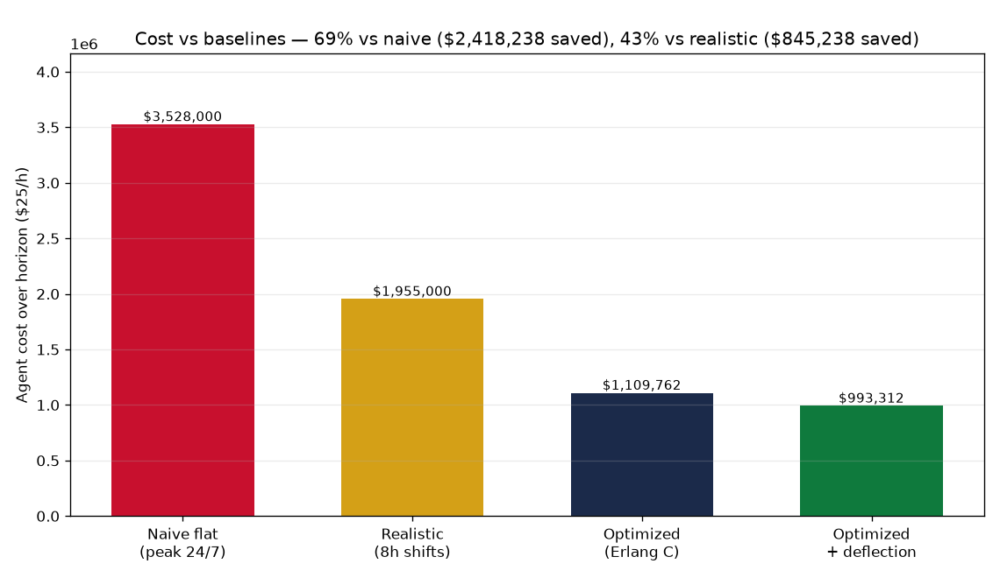
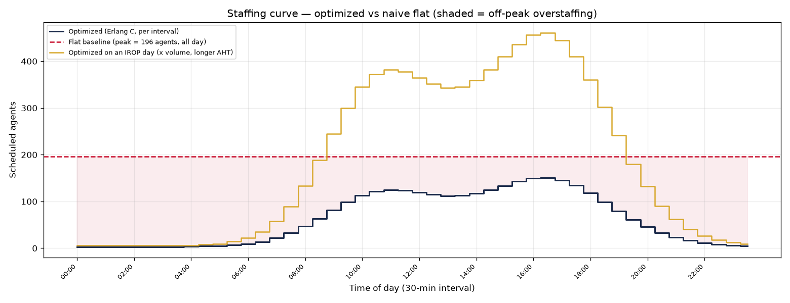
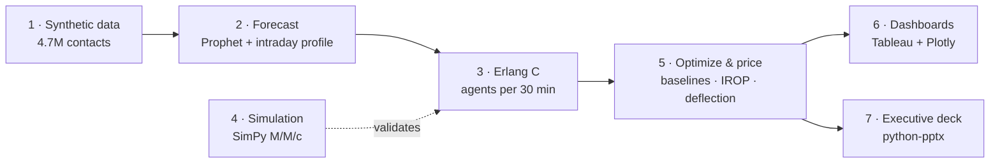

# Delta Reservations — Contact Center Staffing & Service-Level Optimizer

Forecast contact volume for Delta's Atlanta (ATL) Reservations contact center, size staffing for
every 30-minute interval with verified **Erlang C** queueing math, confirm that math with a
discrete-event **simulation**, and turn the result into a costed recommendation — delivered as a
Tableau dashboard and an executive deck.

> **Headline:** staffing each half-hour to the forecast meets the **80/20** service target
> (80% of calls answered within 20 s) in every interval while using **43% fewer agent-hours than
> fixed 8-hour shifts — $845K over a 30-day horizon** at an assumed $25/hour.

> [!IMPORTANT]
> **All data is synthetic.** Real Delta contact-center logs are confidential and don't exist
> publicly, so the ~4.7M contacts are generated from documented, seeded assumptions. Dollar figures
> are modeled results that exercise a real method — not Delta's actual costs. A student project,
> not affiliated with or endorsed by Delta.

**See it without running anything**
- **Interactive dashboard (Tableau Public):** <https://public.tableau.com/app/profile/frank.an5089/viz/DeltaATLReservationsStaffingOptimizer/Dashboard>
- **Executive deck:** [`outputs/Delta_Reservations_Capstone.pptx`](outputs/Delta_Reservations_Capstone.pptx) — 8 slides with speaker notes, recommendation first
- **Offline dashboard (Plotly):** [`outputs/dashboard/dashboard.html`](outputs/dashboard/dashboard.html)

## Results

| Question | Answer |
|---|---|
| How accurate is the forecast? | **9.7% MAPE** on held-out normal days (December); 16.2% including the Christmas spike |
| Is the staffing math right? | Simulation matches Erlang C within **0.38 pts** of service level across 4 load levels (tolerance 3) |
| What does it save? | **43%** fewer agent-hours than fixed 8h shifts (**$845,238** per 30 days); 69% vs naive peak-24/7 |
| What service does it deliver? | **87.8%** of calls answered ≤ 20 s (≥ 80% in every half-hour); 7.9 s average wait; 87% occupancy |
| What about disruption (IROP) days? | Peak scheduled agents go **150 → 461** (~3×); the day needs 3.0× the agent-hours |
| And self-service? | Moving 20% of app-friendly contacts to the Fly Delta app: −11% volume, a further **$116K** |

| Scenario (30-day horizon) | Agent-hours | Cost @ $25/h | Service level |
|---|---:|---:|---:|
| Naive flat — peak headcount (196), 24/7 | 141,120 | $3,528,000 | 99.9% |
| Realistic — 8h shifts, each staffed to its busiest half-hour | 78,200 | $1,955,000 | 98.2% |
| **Optimized — Erlang C, interval by interval** | **44,390.5** | **$1,109,762** | **87.8%** |
| Optimized + app deflection | 39,732.5 | $993,312 | 86.5% |

The baselines' higher service level is the waste: they buy far more service than the 80/20 target
asks for, most of it in quiet hours.




## How it works



| Phase | What it does | Code | Key outputs |
|---|---|---|---|
| 1 | Generates one year of contacts: Poisson arrivals, lognormal handle times, weekly/seasonal/holiday demand, 12–18 IROP disruptions | [`src/generate_data.py`](src/generate_data.py) | `data/raw/contacts.csv` (git-ignored) |
| 2 | Forecasts daily volume with Prophet (SARIMA fallback) and splits days into 48 intervals | [`src/forecast.py`](src/forecast.py) | `forecast.csv`, `intraday_profile.csv`, `forecast.png` |
| 3 | Erlang C engine: service level, wait time, occupancy, minimum agents, shrinkage | [`src/erlang.py`](src/erlang.py) | library (verified table in `python -m src.erlang`) |
| 4 | Simulates the queue call by call and compares measured vs predicted service level | [`src/simulate.py`](src/simulate.py) | `validation.csv`, `validation.png` |
| 5 | Builds the interval staffing plan and prices it against two baselines, plus IROP and deflection scenarios | [`src/optimize.py`](src/optimize.py) | `staffing_plan.csv`, `savings.png`, `staffing_curve.png` |
| 6 | Exports BI-ready CSVs and a self-contained Plotly dashboard | [`src/dashboard.py`](src/dashboard.py) | `outputs/dashboard/` ([Tableau guide](outputs/dashboard/TABLEAU_GUIDE.md)) |
| 7 | Generates the executive deck; every number is read from the pipeline's outputs | [`src/build_deck.py`](src/build_deck.py) | `outputs/Delta_Reservations_Capstone.pptx` |

The project was built phase by phase from [`FLAGSHIP_SPEC.md`](FLAGSHIP_SPEC.md).

## Reproduce

Requires Python 3.11 (Prophet and SimPy wheels).

```bash
python3.11 -m venv .venv && source .venv/bin/activate
pip install -r requirements.txt
python run_all.py     # regenerates data, forecast, validation, staffing plan, figures, dashboards, deck
pytest                # 26 tests
```

`run_all.py` takes under a minute. Every step is seeded and `requirements.txt` pins the exact
library versions, so a fresh clone reproduces the committed results byte for byte.
Each phase also runs on its own: `python -m src.generate_data`, `src.forecast`, `src.erlang`,
`src.simulate`, `src.optimize`, `src.dashboard`, `src.build_deck`. The ~570 MB raw dataset is
git-ignored and regenerated by Phase 1; the small processed files, figures, and deck are committed
so the repo reads without running anything. The Tableau dashboard is authored by hand from the
Phase-6 CSVs.

**Testing — tested where the answer is deterministic, validated where it's random:**
- `tests/test_erlang.py` (10) — exact-value checks against the spec's verified Erlang C table.
- `tests/test_data_quality.py` (11) — invariants that hold for any seed: no nulls, valid categories,
  handle times in range, ≥ 10 distinct IROP events, timestamps inside their interval.
- `tests/test_validation.py` (5) — the simulation agrees with Erlang C within 3 points at 4 loads.

## Assumptions

Every business assumption lives in [`config.py`](config.py) — change one number and re-run.

| Assumption | Value | `config.py` |
|---|---|---|
| Service target | 80% of calls answered within 20 s | `TARGET_SL`, `TARGET_ANSWER_SECONDS` |
| Max occupancy | 90% of agent time busy | `MAX_OCCUPANCY` |
| Shrinkage | 30% of paid time unavailable (breaks, training, meetings) | `SHRINKAGE` |
| Loaded agent cost | $25 per hour | `AGENT_HOURLY_COST` |
| Base demand | 12,000 contacts on a normal day | `BASE_DAILY_CONTACTS` |
| Planning interval / history | 30 minutes / 365 days from 2025-01-01 | `INTERVAL_MINUTES`, `SIM_START`, `SIM_DAYS` |
| Realistic baseline | 8-hour shift blocks, each staffed to its busiest interval | `REALISTIC_BASELINE_BLOCK_HOURS` |
| IROP stress day | 2.5× volume with IROP handle times | `IROP_VOLUME_MULTIPLIER` |
| Self-service deflection | 20% of Booking_Change, Seat_Upgrade, SkyMiles contacts | `DEFLECTION_RATE`, `DEFLECTABLE_REASONS` |
| Random seed | 42 | `SEED` |

### How the synthetic demand is built
Daily volume is `BASE_DAILY_CONTACTS` × layered multipliers (see [`src/generate_data.py`](src/generate_data.py)),
spread over a twin-peak intraday curve, with Poisson counts per interval:

- **Day-of-week** — Monday-high, weekend-low.
- **Seasonal curve (smooth)** — broad summer plateau + year-end shape, deepest trough late
  Jan/early Feb; mean-normalized so it never moves the annual total. Calibrated to the *shape* of
  public TSA checkpoint data.
- **Holiday-travel spikes (discrete)** — calendar-fixed multipliers on the heavy travel days around
  Thanksgiving and Christmas, with the holidays themselves quiet. Volume only.
- **Pre-holiday booking surge** — TSA data counts *passengers*, who peak on the travel day; this
  project models *contacts*, which peak 2–3 weeks earlier, when trips are booked and changed.
- **IROP events** — random weather disruptions (1.8–3.0× volume): the tallest spikes, and the only
  layer that shifts the reason mix toward longer rebooking calls.

Contact reasons and SkyMiles tiers follow fixed mixes; handle times are lognormal per reason with a
small premium for higher tiers.

## Call-center concepts, in plain English

- **Offered load (Erlangs)** — work arriving per interval: 50 calls × 180 s in a 30-minute window
  = 5 Erlangs, i.e. five agents' worth of continuous work.
- **Service level (80/20)** — share of calls answered within a target time; 80% within 20 s is the
  industry default.
- **Average speed of answer (ASA)** — average wait before a call is answered.
- **Occupancy** — share of agent time spent on calls. Above ~90% burns agents out; low means idle pay.
- **Erlang C** — the queueing formula that turns load + agents into service level and wait time;
  run in reverse, it finds the fewest agents that hit the target. For 5 Erlangs at 180 s AHT: 7
  agents give 74% within 20 s, 8 give 88% — so 8.
- **Shrinkage** — time agents are paid but not taking calls. Needing 8 on the phones at 30%
  shrinkage means scheduling 12.
- **IROP (irregular operations)** — cancellations and major delays, usually weather; the reason
  contact volume spikes and the hardest days to staff.
- **Agent-hours** — the common currency: scheduled agents × hours, and × hourly cost for dollars.

## What I learned

- **The baseline decides the headline.** The same plan saves 69% against naive peak-24/7 staffing
  but 43% against fixed 8-hour shifts. I lead with 43%, the comparison that survives questions.
- **Test where it's deterministic, validate where it's random.** Erlang C gets exact-value tests; the
  generated data gets invariant tests; the simulation gets an agreement test. A single 60k-call run
  missed the 3-point tolerance on ~18% of seeds at high occupancy (queue waits are autocorrelated),
  so the test averages 8 replications instead of loosening the tolerance.
- **A forecast should only claim what it can know.** Blanking IROP days out of training made the
  95% band ~4× narrower (it had dipped below zero) for a small cost in accuracy (8.7% → 9.7% MAPE);
  disruptions are handled as a separate stress scenario instead.
- **Passengers aren't contacts.** Travel volume peaks on the holiday; calls peak weeks before it.
- **One year of history can't teach yearly seasonality.** Prophet disables its yearly term with
  under two years of data, so the January forecast carries December's level forward (see below).

## Limitations and future work

- **Synthetic data** proves the pipeline is internally consistent and the method works end to end;
  it is not a claim about Delta's real volumes or costs.
- **The January forecast runs ~18% above last January** (11,785 vs 9,974 contacts/day), so absolute
  dollars are likely overstated; percentage savings are more robust because every scenario uses the
  same forecast.
- **Erlang C assumes no abandonment and exponential handle times.** The simulation validates the
  formula on those terms; its optional `patience_seconds` argument turns it into an Erlang A model.
- **`apply_shrinkage` float rounding** — the spec's verified code, kept verbatim, occasionally rounds
  up one extra agent (e.g. 322 required → 461 scheduled, not 460): 24 of 1,440 intervals,
  +12 agent-hours (~$300, 0.03%).
- **Out of scope:** turning interval requirements into shift rosters, multi-skill routing,
  chat/app channels, and intraday re-forecasting. Deliberately deferred: a fully passenger-shaped
  seasonal curve and more holiday notches (July 4, Memorial Day, Labor Day, New Year) — the
  forecaster learns whatever seasonality is present, so more shape-matching has diminishing returns.

## Project structure

```
delta-staffing-optimizer/
├── run_all.py               # whole pipeline, one command
├── config.py                # every tunable assumption
├── src/
│   ├── generate_data.py     # 1  synthetic contacts
│   ├── forecast.py          # 2  Prophet (+ SARIMA fallback), intraday profile
│   ├── erlang.py            # 3  verified Erlang C engine
│   ├── simulate.py          # 4  SimPy validation
│   ├── optimize.py          # 5  staffing plan, savings, IROP + deflection scenarios
│   ├── dashboard.py         # 6  BI-ready CSVs + Plotly dashboard
│   └── build_deck.py        # 7  executive deck
├── tests/                   # Erlang C math, data quality, simulation agreement
├── data/
│   ├── raw/                 # contacts.csv (git-ignored, regenerated)
│   └── processed/           # forecast, staffing plan, metric summaries
├── outputs/
│   ├── figures/             # PNG charts
│   ├── dashboard/           # CSVs, dashboard.html, TABLEAU_GUIDE.md
│   └── Delta_Reservations_Capstone.pptx
└── FLAGSHIP_SPEC.md         # the phase-by-phase build spec
```
